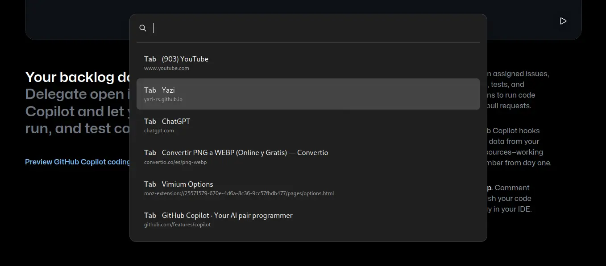
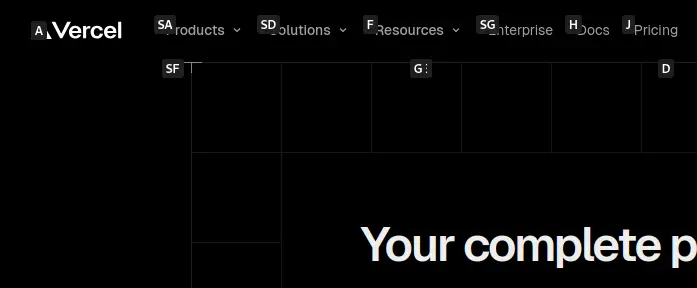
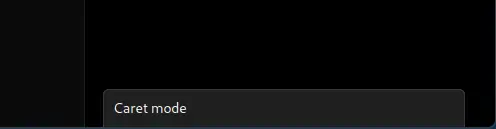

# Vimium Zen Theme

A custom dark theme for the Vimium browser add-on inspired by Zen Browser's floating search bar, with code based on [mxxjng/vimium-glass-theme](https://github.com/mxxjng/vimium-glass-theme). For more custom themes, visit [Vimium's GitHub wiki](https://github.com/philc/vimium/wiki/Theme) on themes.

### Installing Vimium

You can install [Vimium](https://github.com/philc/vimium) from your respective browser's add-ons store:

- [Google Chrome](https://chrome.google.com/webstore/detail/vimium/dbepggeogbaibhgnhhndojpepiihcmeb?hl=en)
- [Firefox](https://addons.mozilla.org/en-GB/firefox/addon/vimium-ff/)

[More instructions](https://github.com/philc/vimium)

### Customising Your Vimium's CSS

Copy the code in the [CSS file](https://github.com/RanMd/vimium-zen-theme/blob/main/stylesheet.css) into 'CSS for Vimium UI' inside 'Vimium Options' in your browser's add-ons settings:

- Google Chrome: chrome://extensions/
- Firefox: about:addons

Note that you may have to reload the page for the custom CSS to take effect.

### Screenshots

#### Vomnibar

#### Link Hints

#### Heads Up Display

#### Help Dialog

### Customization
You can customize the colors to your liking by changing the variables inside `:root`

### Thanks to
- [Max Jung](https://github.com/mxxjng)

### Licennse
[MIT License](https://github.com/RanMd/vimium-zen-theme/blob/main/LICENSE)
